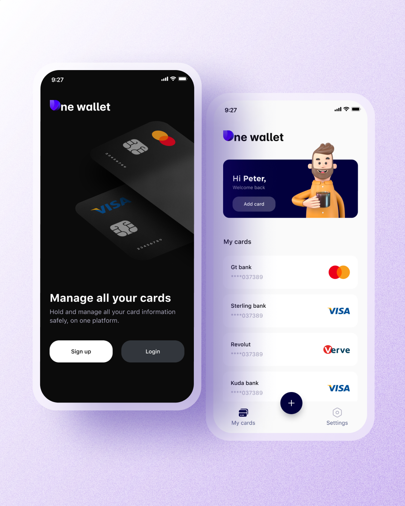

# OneWallet

OneWallet - One wallet is a Virtual card holder that keeps all your bank details inside your mobile phone.
One wallet is a secure platform hence all information is kept offline so it is unhackable. One
wallet uses Face ID and fingerprint for security. If you need to backup your one wallet data,
you can export it as a CSV file and save it anywhere of your choice.
## Screenshots

